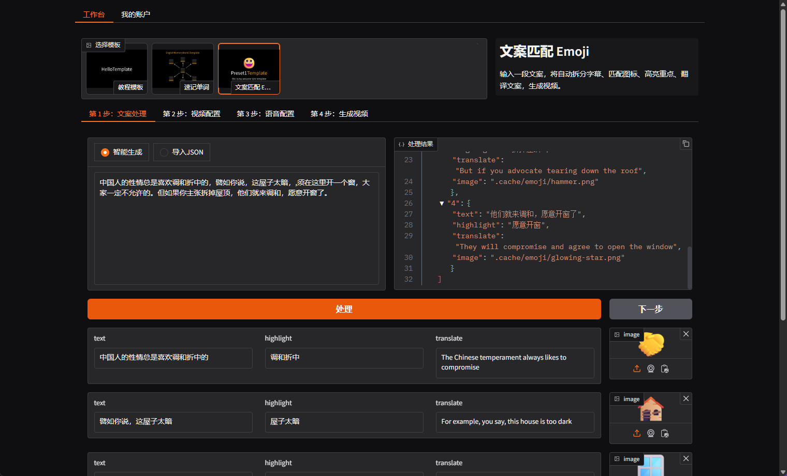
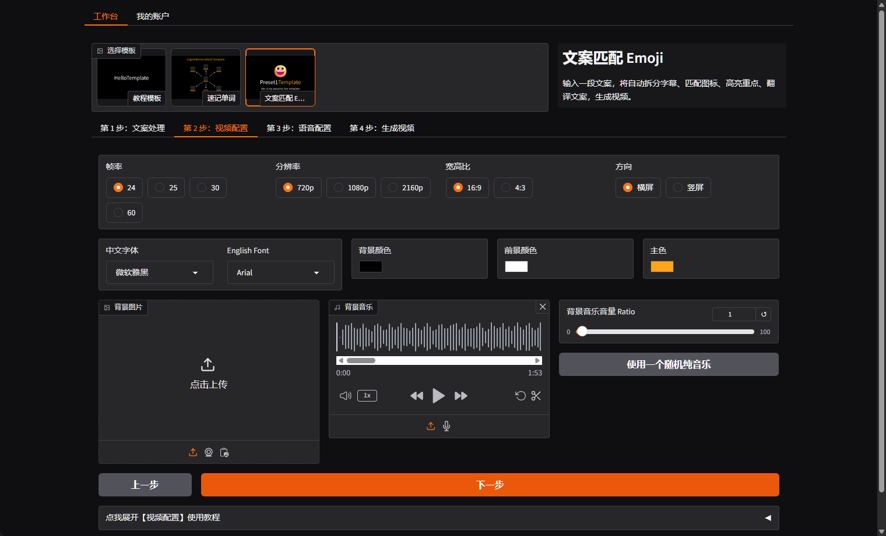
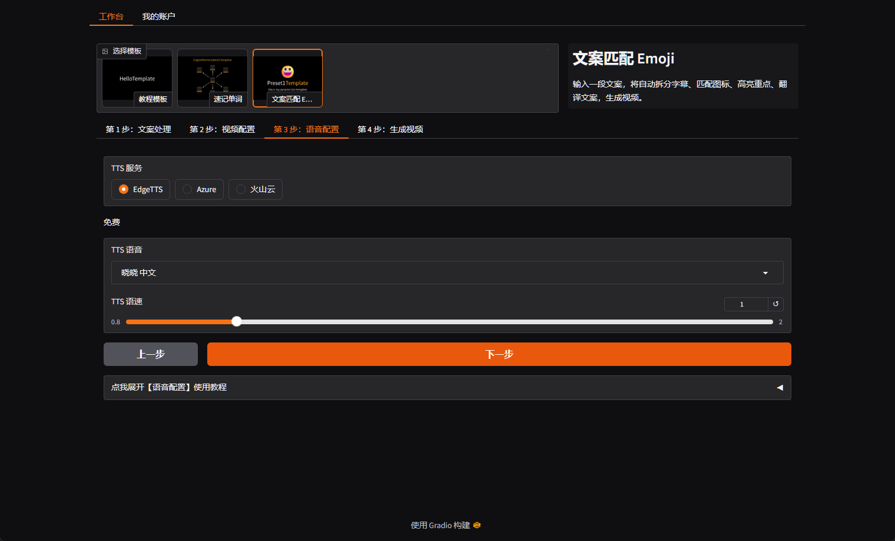
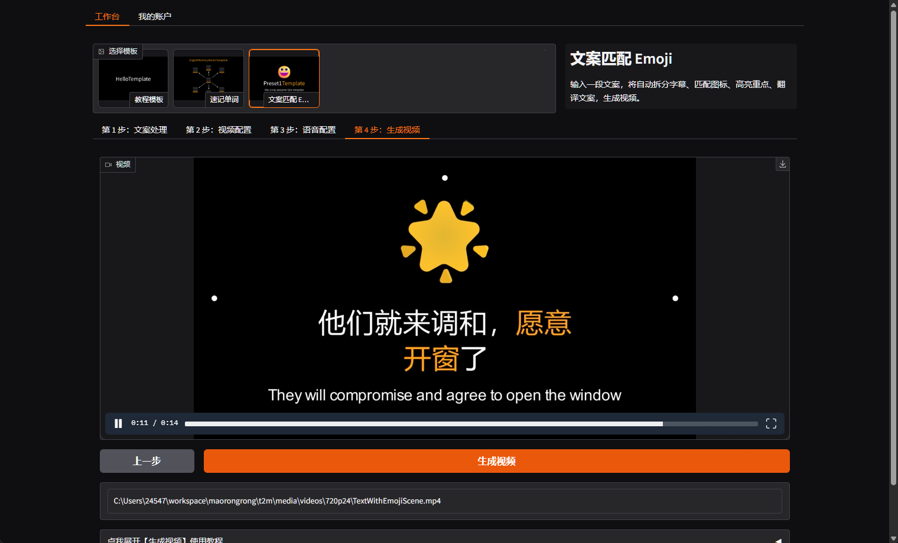

  

  <h3>ClipTurbo 小视频宝</h3>

  

    🚀 AI 驱动的短视频宝藏工具 - 灵活，快速，易于变现。
     
     
    <a href="https://sanhua.himrr.com/clipturbo">Website</a>
    ·
    <a href="https://sanhua.himrr.com/sanhua-wx-qrcode.jpg">Wechat</a>
    ·
    <a href="https://twitter.com/intent/follow?screen_name=yrmkejun">X</a>
    ·
    <a href="https://github.com/clipturbo/clipturbo/releases">Releases</a>
  

## 关于

小视频宝(ClipTurbo)，一个易于使用的由 AI 驱动短视频生成工具，皆在帮助每个人成为吸粉短视频创作达人，让你的视频轻松变现。

AI: 我们利用 AI 为你处理文案、翻译、图标匹配、TTS 语音合成，最终使用 [manim](https://docs.manim.community/) 来渲染视频，告别纯生成式 AI 被平台限流的问题。

模板: 得益于 manim ，每个 Scene 都可以是一个模板，我们正在努力提供更多模板。

支持的平台: 现在我们的第一优先级是 Windows 系统，稍晚一些会推出 MacOS 客户端，此外我们还有一个即将下线的 [Web 体验版](https://text2motion.himrr.com/)，但强烈建议你使用客户端。

本仓库用于发布小视频宝的 [Release](https://github.com/clipturbo/clipturbo/releases) 版本以及使用 Github Issues 收集和跟进用户反馈。

小视频宝未来是否开源取决于社区反馈，如果你有好的想法，欢迎在 [Issues](https://github.com/clipturbo/clipturbo/issues) 中提出。

### 近期更新

你可以查看我们的[更新计划和路线图](https://github.com/orgs/clipturbo/projects/1)！

- 现在支持选择输出文件夹
- 主工作台的 UI 更加简洁，模板简介和模板配置合并到同一 Tab 中
- 实现了一个 30w 粉博主在用的新模板！
- 视频自定义背景图片现在支持透明度设置
- 新增了免费的火山云 TTS 支持
- 现在有一个设置面板，可以配置 Proxy、管理缓存等

## 截图

我们还在积极开发中，下面的截图仅供参考。

### 主工作台

在这里选择模板，使用 AI 预处理文案

### 视频配置

你可以选择任意分辨率、帧率、宽高比或屏幕方向，模板将自动适配。你还可以选择本地字体，上传图片和背景音乐！

### 语音配置

内置 EdgeTTS 语音，完全免费，助你随意生成，支持多种人声和语速调节，适配 Azure、火山云、FishAudio 等多家语音服务！

### 生成视频

你可以在这里生成和预览生成的视频，字幕文件存放在视频同一目录中。

## 版本

目前，小视频宝仍处于早期开发人员预览阶段 （alpha），仅提供给[三花 AI](https://sanhua.himrr.com/) 的注册用户提供。

使用微信打开三花官网后将自动注册，然后你可以选择下面任意一个方法来使用：

- 前往 [GitHub Release](https://github.com/clipturbo/clipturbo/releases) 下载二进制文件（**推荐**）
- 在[三花](https://sanhua.himrr.com/clipturbo)官网下载

## License

GNU General Public License version 3
